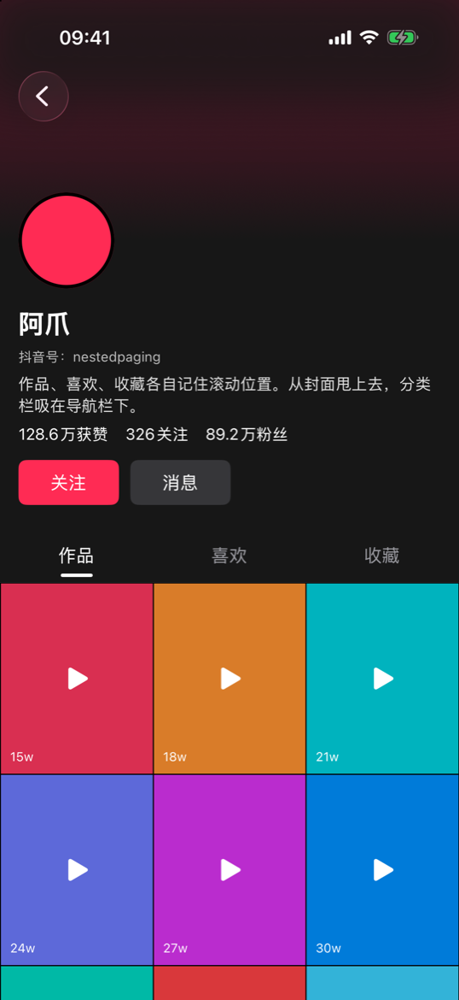
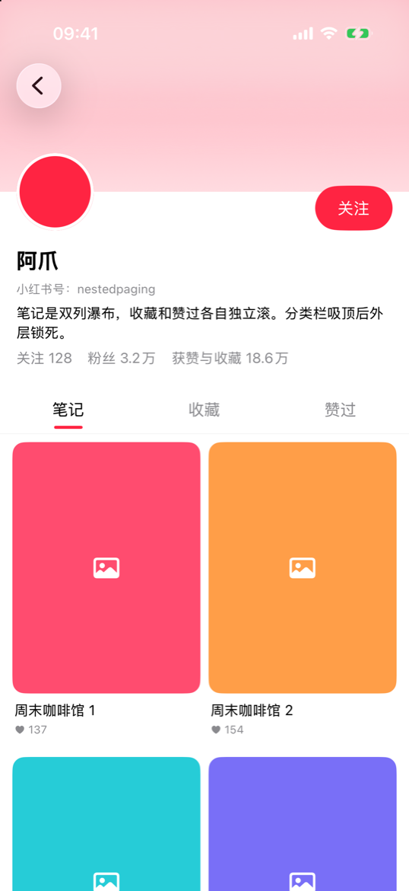
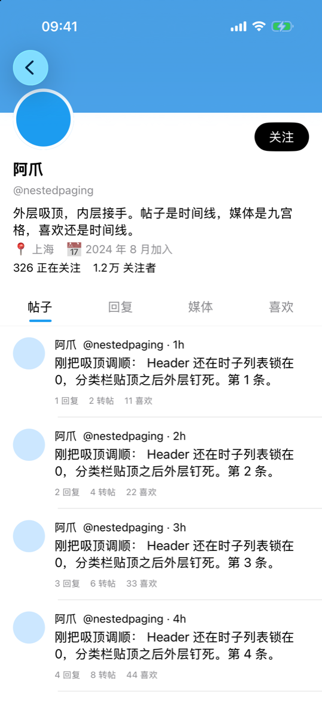
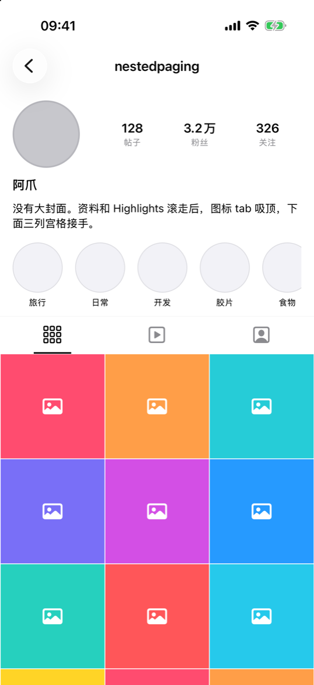
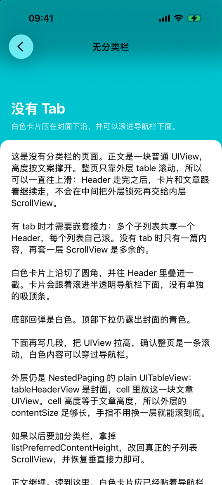

# NestedPaging

[English](README.md) | [中文](README.zh-CN.md)

UIKit 嵌套滚动容器。用于「顶部 Header 滚出视口、中间分类栏吸顶、底部多个子列表既可垂直滚动也可水平切换」的页面。

本仓库为独立实现，无第三方依赖。

**抖音**



**小红书**



**X**



**Instagram**



**无分类栏**



示例工程：`Demo/NestedPagingDemo.xcodeproj`。前四个页面共用同一套 `NestedPagingView`，差异仅在 Header、吸顶栏与子列表。**无分类栏**不同：严格来说已不是嵌套滚动。没有分类栏，也没有第二层 `UIScrollView`，由外层 table 带着 Header 和一篇文章 `UIView` 一起滚。

## 要求

- iOS 17+
- Swift 5.9+
- UIKit

## 安装

### Swift Package Manager

Xcode：File → Add Package Dependencies，输入

```
https://github.com/shenxiang11/NestedPaging
```

当前尚未发布语义化版本，请依赖 `main` 分支。

```swift
dependencies: [
    .package(url: "https://github.com/shenxiang11/NestedPaging", branch: "main")
]
```

本地路径：

```swift
.package(path: "../NestedPaging")
```

```swift
import NestedPaging
```

## 使用

实现 `NestedPagingViewDelegate`，将 `NestedPagingView` 铺满容器后调用 `reloadData()`。子列表实现 `NestedPagingListViewDelegate`，并在自身的 `scrollViewDidScroll(_:)` 中转发回调。

```swift
import NestedPaging
import UIKit

final class PageViewController: UIViewController, NestedPagingViewDelegate {
    private let pagingView = NestedPagingView()
    private let headerView = YourHeaderView()
    private let pinBar = NestedPagingPinBar(titles: ["动态", "作品"])

    override func viewDidLoad() {
        super.viewDidLoad()

        pinBar.onSelectIndex = { [weak self] index in
            self?.pagingView.setCurrentListIndex(index, animated: true)
        }

        pagingView.delegate = self
        pagingView.listContainerDidScroll = { [weak self] _ in
            guard let self else { return }
            self.pinBar.setProgress(self.pagingView.currentListScrollProgress, animated: false)
        }

        view.addSubview(pagingView)
        pagingView.frame = view.bounds
        pagingView.autoresizingMask = [.flexibleWidth, .flexibleHeight]
        pagingView.reloadData()
    }

    func tableHeaderViewHeight(in pagingView: NestedPagingView) -> CGFloat { 200 }
    func tableHeaderView(in pagingView: NestedPagingView) -> UIView { headerView }
    func heightForPinSectionHeader(in pagingView: NestedPagingView) -> CGFloat { 48 }
    func viewForPinSectionHeader(in pagingView: NestedPagingView) -> UIView { pinBar }
    func numberOfLists(in pagingView: NestedPagingView) -> Int { 2 }
    func pagingView(_ pagingView: NestedPagingView, initListAt index: Int) -> NestedPagingListViewDelegate {
        YourListView()
    }
}
```

```swift
final class YourListView: UIView, NestedPagingListViewDelegate, UITableViewDelegate {
    private let tableView = UITableView()
    private var scrollCallback: ((UIScrollView) -> Void)?

    func listView() -> UIView { self }
    func listScrollView() -> UIScrollView { tableView }

    func listViewDidScrollCallback(_ callback: @escaping (UIScrollView) -> Void) {
        scrollCallback = callback
    }

    func scrollViewDidScroll(_ scrollView: UIScrollView) {
        scrollCallback?(scrollView)
    }
}
```

吸顶栏可使用 `NestedPagingPinBar`，也可返回任意自定义 `UIView`。

将 `NestedPagingView` 贴齐屏幕顶边时，分类栏默认停在导航栏下方。若将容器约束在 `safeAreaLayoutGuide.topAnchor` 之下，自动计算的吸顶偏移为 `0`。

## 无分类栏

严格来说，这个场景已经不是嵌套滚动。嵌套滚动需要两层垂直 `UIScrollView`，并在 `maxOffsetY` 处接力。没有 tab 时只有一篇内容，再套一层 `UIScrollView` 是多余的。

`listView()` 返回普通 `UIView`，并实现 `listPreferredContentHeight(forWidth:)`，由外层 table 带着 Header 和正文一起滚。

```swift
func heightForPinSectionHeader(in pagingView: NestedPagingView) -> CGFloat { 0 }
func numberOfLists(in pagingView: NestedPagingView) -> Int { 1 }

func listPreferredContentHeight(forWidth width: CGFloat) -> CGFloat? {
    // 文章 UIView 在该宽度下的高度
    articleHeight
}
```

此模式下 NestedPaging 按该高度撑开 cell，不再做垂直接力，并把底部安全区 inset 加在 `mainTableView` 上。Demo 里的「无分类栏」是白色圆角卡片压在 Header 上，并可滚进透明导航栏下面。

## API

### NestedPagingView

| 成员 | 说明 |
| --- | --- |
| `delegate` | 提供 Header、吸顶栏与子列表。 |
| `pinSectionHeaderVerticalOffset` | 分类栏吸顶时距容器顶边的距离。 |
| `automaticallyAdjustsPinSectionHeaderVerticalOffset` | 默认 `true`。为 `true` 时，`pinSectionHeaderVerticalOffset` 跟随 `safeAreaInsets.top`。 |
| `automaticallyAdjustsListContentInset` | 默认 `true`。为子列表叠加容器的 bottom / left / right 安全区 inset。若页面报告了内容高度，则加在 `mainTableView` 上。 |
| `mainTableView` | 外层 `UITableView`（plain）。 |
| `listContainerView` | 水平分页容器。子列表按需创建。 |
| `currentListIndex` | 当前页索引。 |
| `currentScrollingListView` | 当前参与垂直接力的子 `UIScrollView`。 |
| `currentListScrollProgress` | 水平分页进度，等于 `contentOffset.x / pageWidth`。 |
| `mainTableViewMaxContentOffsetY` | 外层允许的最大 offset，即 `headerHeight - pinSectionHeaderVerticalOffset`。 |
| `reloadData()` | 重新读取 delegate 并刷新 Header、分页与外层 table。 |
| `setCurrentListIndex(_:animated:)` | 切换子列表。 |
| `mainTableViewDidScroll` | 外层垂直滚动回调。 |
| `listContainerDidScroll` | 水平分页滚动回调。 |
| `didChangeListIndex` | 当前页索引变化。 |

`NSCoder` 初始化不可用。类型标注 `@MainActor`。

### NestedPagingViewDelegate

| 方法 | 说明 |
| --- | --- |
| `tableHeaderViewHeight(in:)` | Header 高度。 |
| `tableHeaderView(in:)` | Header 视图，置于外层 table 的 `tableHeaderView`。 |
| `heightForPinSectionHeader(in:)` | 吸顶栏高度。 |
| `viewForPinSectionHeader(in:)` | 吸顶栏视图，置于外层 table 的 section header。 |
| `numberOfLists(in:)` | 子列表数量。 |
| `pagingView(_:initListAt:)` | 创建指定页的子列表。仅在该页进入邻近范围时调用。 |

### NestedPagingListViewDelegate

任意 `UIScrollView` 子类均可作为子列表，包括 `UITableView` 与 `UICollectionView`。实现 `listPreferredContentHeight(forWidth:)` 时，普通 `UIView` 也可以。

| 方法 | 说明 |
| --- | --- |
| `listView()` | 嵌入分页容器的根视图。 |
| `listScrollView()` | 参与垂直嵌套的滚动视图。若实现了内容高度，则不使用。 |
| `listViewDidScrollCallback(_:)` | 保存回调，并在该滚动视图的 `scrollViewDidScroll(_:)` 中调用。未转发则垂直接力失效。 |
| `listPreferredContentHeight(forWidth:)` | 可选，默认 `nil`。非 `nil` 时 cell 用该高度，由外层 table 滚整页，不再做内层接力。 |

### NestedPagingPinBar

等分标题栏，带滑动指示条。可选。

```swift
let pinBar = NestedPagingPinBar(titles: ["动态", "作品"], indicatorColor: .label)
pinBar.onSelectIndex = { index in
    pagingView.setCurrentListIndex(index, animated: true)
}
pinBar.setProgress(pagingView.currentListScrollProgress, animated: false)
```

## 滚动模型

外层是一张 plain `UITableView`：

```
┌─────────────────────────────┐
│ tableHeaderView             │  Header
├─────────────────────────────┤
│ section header              │  分类栏（plain style 吸顶）
├─────────────────────────────┤
│ 唯一 cell                   │  高度 = bounds.height − 分类栏 − 吸顶偏移
│   └─ 横向 paging scroll     │
│        ├─ 列表 0            │
│        └─ 列表 1            │
└─────────────────────────────┘
```

外层 table 的 `contentInsetAdjustmentBehavior` 为 `.never`，`sectionHeaderTopPadding` 为 `0`。

垂直方向：外层 table 与当前子列表同时识别同一 `UIPanGestureRecognizer`。由 `contentOffset` 决定实际滚动者。

```
maxOffsetY = tableHeaderViewHeight − pinSectionHeaderVerticalOffset
```

| 条件 | 外层 | 子列表 |
| --- | --- | --- |
| 外层 offset `< maxOffsetY` | 滚动 | 所有列表锁定在顶部（含 `adjustedContentInset.top`） |
| 外层到达 `maxOffsetY` | 锁定 | 滚动 |
| 子列表尚未回到顶部 | 锁定在 `maxOffsetY` | 滚动 |
| 子列表回到顶部后再下拉 | 滚动，Header 回入 | 所有列表重置到顶部 |

Header 可见性是唯一真相。Header 露着时，**所有**子列表都停在顶部，不只是当前页。因此在另一个 tab 把 Header 拉回来后，其他列表的残留 offset 会被清掉，再切回去不会突然吸顶。

Header 未吸顶时，子列表 `bounces` 为 `false`。同一时刻仅当前子列表的 `scrollsToTop` 为 `true`。

若 `listPreferredContentHeight(forWidth:)` 非 `nil`，cell 高度用该值，只由外层 table 滚动，外层不会锁在 `maxOffsetY`。

水平分页由独立的 paging `UIScrollView` 处理，与垂直嵌套互不共用手势。第一页向右滑时不开始水平识别，以便系统返回手势生效。

## 限制

从 Header 区域快速甩动时，外层滚动到 `maxOffsetY` 后停止。惯性不会传入当前子列表。这是 offset 锁定模型的既有行为，不是缺陷修复项。
